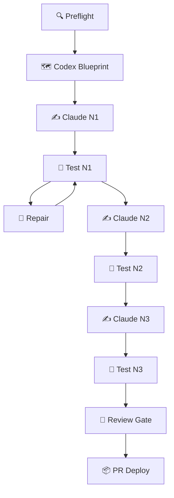

# 🤖 Terence-Agent

> Hermes Agent 日志体系 + 项目工作区
> 仓库: [Leisure-Auf1/Terence-Agent](https://github.com/Leisure-Auf1/Terence-Agent)

---

## 🧠 A3 多智能体系统

> 基于大模型的个性化资源生成与学习多智能体系统



**目录**: `projects/a3-multi-agent-system/`

### 核心模块 (3600+ 行)

| 模块 | 功能 |
|:-----|:-----|
| `review_gate.py` | 三道门禁: AST静态 + Pytest双向动态 + Judge评分 |
| `user_simulation.py` | 模拟学生试读: 认知负荷/画像排异/心智断层 → 第一人称日记 |
| `sandbox.py` | 事务沙箱: 物理快照 + ReAct自愈 + Commit/Rollback |
| `contracts.py` | 契约: FuseReport(工单追溯+MD5账本) + FailurePatternLesson |
| `meta_reflector.py` | 元反思: 失败→结构化教训 + 自适应Prompt |
| `quarantine.py` | 冷冻隔离: 犯罪现场克隆 + MD5闭锁 + 一键复现脚本 |
| `reverse_committer.py` | 逆向反哺: 人类修复→Gate重审→回写主干 |
| `prompt_injector.py` | 双轨Prompt: HUMAN绝对置顶 + AGENT次级补位 |
| `content_agent.py` | 强类型5资产: 讲义/Mermaid/题库/多模态锚点/沙箱 |
| `agent_router.py` | 双引擎路由: 讯飞星火(前场) + DeepSeek(后场) |

### 验证

- **跨学科盲跑**: Python装饰器(85/85/85) → Git DAG Topology(87/87/92)
- **测试**: Review Gate 24/24 + UserSim 16/16
- **Heres Studio 工作流**: ID `482e06bd`, 11节点串行, 4次执行
- **Git**: PR #11~#15 squash merged → `main`

### 快速启动

```bash
cd projects/a3-multi-agent-system
source activate.sh
python -m core.review_gate outputs/ --node-id NODE_1 --verbose
```

---

## 目录结构

```
├── projects/
│   ├── a3-multi-agent-system/  ← 🧠 多智能体系统
│   ├── campus-task/            ← 校园任务
│   ├── computer-setup/         ← 电脑维护
│   ├── lab-report/             ← 实验报告
│   └── ucampus/                ← U校园自动化
│
├── event-report/               ← 📋 日操作记录
├── agent-team/                 ← Agent 角色定义
├── sync.sh                     ← 一键同步
└── README.md
```

## 同步

```bash
bash ~/Terence-Agent/sync.sh "📝 说明"
```
