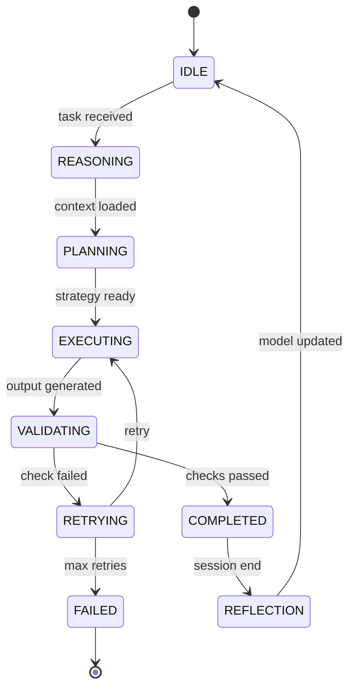
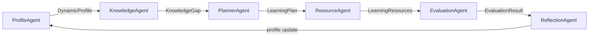

# Veritas-Core — Architecture

> **Production Agent Infrastructure | Runtime State Machine | Trust Layer | RAG Engine**

---

## System Overview

Veritas-Core is the **architectural evolution** from A3 toward production-grade agent infrastructure. It introduces a runtime state machine for agent lifecycle, a security-aware EventBus, 3-tier memory persistence, and a trust layer for content integrity.

---

## Production Agent Runtime

### Agent Runtime State Machine

Every cognitive agent follows a 10-state lifecycle managed by `AgentRuntime`:



States:
- **IDLE** → waiting for `AgentTask` dispatch
- **REASONING** → loading context (memory, RAG, profile)
- **PLANNING** → building execution strategy
- **EXECUTING** → subclass `execute()` runs
- **VALIDATING** → trust checks on output
- **COMPLETED** → success, emit EventBus event
- **RETRYING** → error recovery (max 3 retries)
- **FAILED** → terminal error state
- **REFLECTION** → post-session model update

---

### Agent + Tool Architecture

```
┌──────────────────────────────────────────────────────────┐
│                     Orchestrator                          │
│              (Pipeline DAG Engine)                        │
│                                                           │
│  ┌──────────┐  ┌──────────────┐  ┌──────────┐           │
│  │ProfileAgent│  │KnowledgeAgent│  │PlannerAgent│          │
│  │ 画像构建   │  │ RAG知识检索   │  │ 路径规划   │          │
│  └─────┬─────┘  └──────┬───────┘  └─────┬─────┘          │
│        │               │                │                 │
│  ┌─────┴─────┐  ┌──────┴───────┐  ┌─────┴─────┐          │
│  │ResourceAgent│ │EvaluationAgent│ │ReflectionAgent│        │
│  │ Tool调度    │  │ 双重评估      │  │ 画像+路径调整│       │
│  └─────┬─────┘  └──────────────┘  └─────────────┘        │
│        │                                                  │
│  ┌─────┴──────────────────────────────────────┐           │
│  │              Skill Router                    │          │
│  │    Intent → Match → Permission → Load       │          │
│  └─────┬──────────────────────────────────────┘           │
│        │                                                  │
│  ┌─────┼─────┬──────────┬──────────┬──────────┐          │
│  │DocGen│PPTGen│ QuizGen │CodeGen  │MindMapGen│          │
│  └─────┴─────┴──────────┴──────────┴──────────┘          │
└──────────────────────────────────────────────────────────┘
```

- **6 Cognitive Agents**: reasoning + decision-making
- **5 Generator Tools**: content execution (Document, PPT, Quiz, Code, Mindmap)
- **Skill Router**: intent-based tool dispatch with permission control

---

## Agent Lifecycle (Detailed)

```mermaid
graph TD
    O[Orchestrator] -->|dispatch AgentTask| A[Agent.idle]
    A -->|run()| R[REASONING: load_context]
    R -->|context ready| P[PLANNING: strategy]
    P -->|strategy set| E[EXECUTING: execute payload]
    E -->|output| V[VALIDATING: trust check]
    V -->|pass| C[COMPLETED: emit event]
    V -->|fail| RT{RETRYING: can retry?}
    RT -->|yes| E
    RT -->|no| F[FAILED: error event]
    C -->|session end| RF[REFLECTION: update models]
    RF --> A
```

---

## EventBus (Secure)

```
┌──────────────────────────────────────────┐
│           AgentEventBus (Singleton)       │
│                                           │
│  Emit: SecureAgentEvent                   │
│  ┌─────────────────────────────────────┐ │
│  │ event_id    → uuid (traceable)      │ │
│  │ source_agent → who                  │ │
│  │ action       → what                 │ │
│  │ status       → success/error        │ │
│  │ trace_id     → cross-agent tracking │ │
│  │ session_id   → user session         │ │
│  │ permission   → read/write/admin     │ │
│  │ audit_id     → security audit       │ │
│  │ duration_ms  → performance          │ │
│  └─────────────────────────────────────┘ │
│                                           │
│  Safety: trace_id + permission per event  │
└──────────────────────────────────────────┘
```

---

## MemoryManager (3-Tier)

```
┌─────────────────────────────────────────────────────┐
│                  MemoryManager                        │
│                                                       │
│  Tier 1: Conversation Memory (Redis, TTL=24h)        │
│  ├── Session context                                 │
│  └── Agent-Chat turns                                │
│                                                       │
│  Tier 2: Profile Memory (PostgreSQL)                  │
│  ├── DynamicProfile (8-dim)                          │
│  ├── MasteryRecord (EMA α=0.5)                       │
│  ├── WeakPoint tracking                              │
│  └── ProfileEvolution audit trail                    │
│                                                       │
│  Tier 3: History Memory (PostgreSQL + ChromaDB)       │
│  ├── LearningRecord (action log)                     │
│  ├── ExerciseError (mistake log)                     │
│  ├── ResourceFeedback (quality data)                 │
│  └── ExperienceRecord (cross-student lessons)         │
│                                                       │
│  MVP: In-memory dicts                                │
│  Production: PostgreSQL + Redis + ChromaDB            │
└─────────────────────────────────────────────────────┘
```

---

## LLM Provider Abstraction

```
┌──────────────────────────────────────┐
│         LLMProvider (abstract)        │
│                                       │
│  generate(prompt, system_prompt,     │
│           temperature) → LLMResponse │
│  generate_stream(...) → Iterator     │
│                                       │
│  ┌──────────────┐  ┌───────────────┐ │
│  │MockLLMProvider│  │XunfeiSpark    │ │
│  │ deterministic │  │ OpenAI-compat │ │
│  │ testing       │  │ production    │ │
│  └──────────────┘  └───────────────┘ │
│                                       │
│  Future: OpenAI, Anthropic, Ollama    │
└──────────────────────────────────────┘
```

---

## Planner Pipeline



Steps:
1. **ProfileAgent**: Extract 8-dim profile from NL (rule + LLM dual mode)
2. **KnowledgeAgent**: RAG retrieval → knowledge gap analysis
3. **PlannerAgent**: Adaptive path generation (pace, depth, style)
4. **ResourceAgent**: Orchestrate tool generation (Document, PPT, Quiz, Code, Mindmap)
5. **EvaluationAgent**: Dual evaluation (learning outcome + agent quality)
6. **ReflectionAgent**: Update profile, store experience

---

## Future: RAG Integration (Phase 2)

```
Query → Parser → Chunker → Embedder → VectorDB → Retriever → Assembler
                                                                    │
                                                              KnowledgeContext
                                                                    │
                                                              ResourceAgent
```

---

## Trust Layer (Phase 3)

```
┌─────────────────────────────────────────────┐
│              Trust Layer                     │
│                                              │
│  ┌──────────────────┐  ┌──────────────────┐ │
│  │ Memory Validation │  │ Agent Permission │ │
│  │ 6-step pipeline  │  │ Capability matrix│ │
│  │ candidate/confirm │  │ Tool Call Gateway│ │
│  └──────────────────┘  └──────────────────┘ │
│                                              │
│  ┌──────────────────┐  ┌──────────────────┐ │
│  │ Injection Defense │  │ Content Grounding│ │
│  │ 4-layer: Sanitize │  │ Source check →   │ │
│  │ → Detect → Isolate│  │ RAG citation     │ │
│  │ → Validate        │  │ → Hallucination  │ │
│  └──────────────────┘  └──────────────────┘ │
└─────────────────────────────────────────────┘
```

---

## Roadmap

| Phase | Content | Status |
|:------|:--------|:------:|
| Phase 0 | Architecture Freeze (12 design docs) | ✅ |
| Phase 1 | Core agents + Memory + EventBus | ✅ |
| Phase 2 | RAG Engine + KnowledgeAgent | ⏳ |
| Phase 3 | Trust Layer (permissions, injection defense) | ⏳ |
| Phase 4 | Skill System + Generator Tools | ⏳ |
| Phase 5 | FastAPI + Docker + Deployment | ⏳ |
